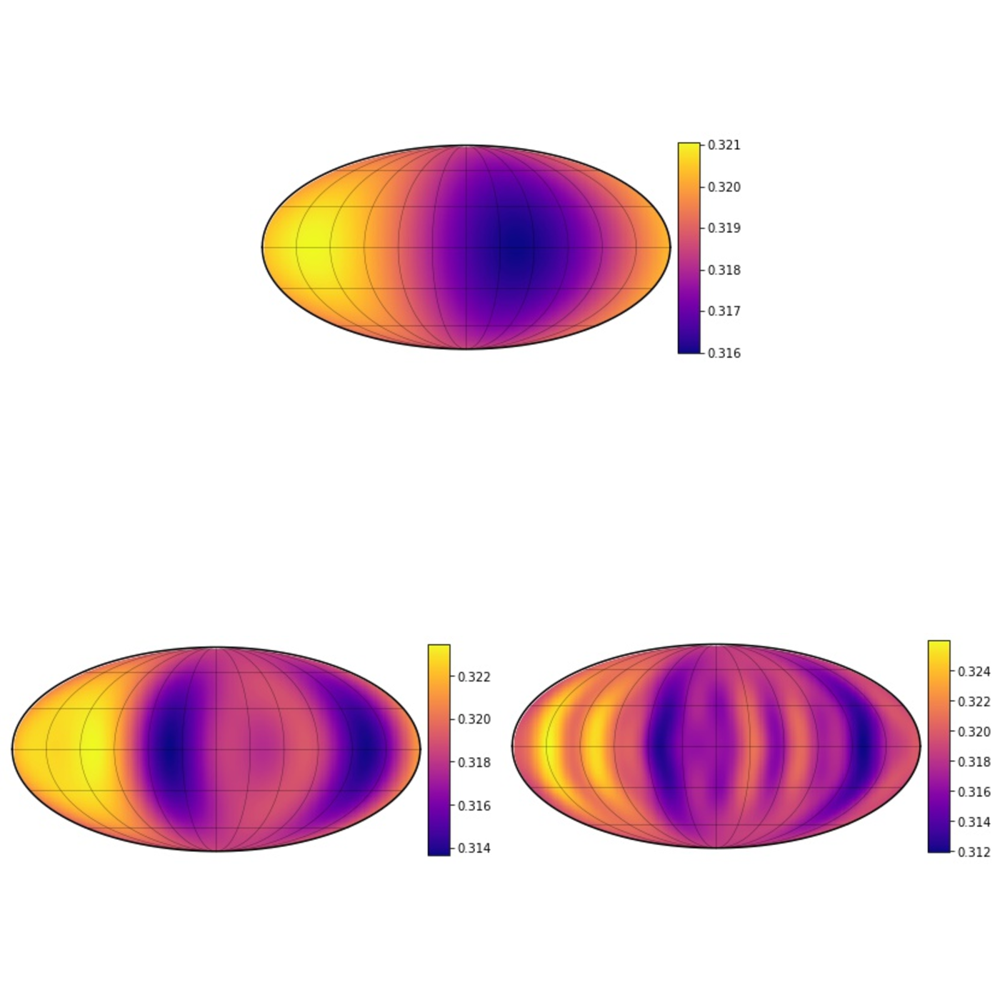

---

title: "Mapping Brown Dwarf and Giant Exoplanet Atmospheres"
summary: "Using rotational photometric variability to probe evolving cloud structures in substellar atmospheres."
date: 2021-05-01
featured: true
weight: 20
authors:
  - admin
tags:
  - "Atmospheric Variability"
  - "Brown Dwarfs"
  - "Time-Series Analysis"
  - "Photometry"
image:
  preview_only: true
---

*Comparing the three reconstructions showed that \(l=5\) captured the principal light-curve structure without introducing the unnecessary complexity present at higher harmonic degree.*

Brown dwarfs provide accessible analogs for directly imaged giant exoplanets because rotational brightness variations can reveal heterogeneous cloud structures in their atmospheres. In this project, I used **starry**, a spherical-harmonic light-curve inversion framework, to test how reliably atmospheric brightness maps could be reconstructed from time-series photometry. I first applied the method to synthetic light curves generated from three-dimensional atmospheric circulation models, where the underlying atmospheric behavior was known. By comparing reconstructions at different spherical-harmonic degrees, I found that \(l=5\) provided sufficient complexity to reproduce the principal light-curve structure without introducing unnecessary additional features.

I then applied the same method to published Spitzer observations of the variable planetary-mass objects **2MASS J0030300−145033** and **2MASS J06420559+4101599**. A static map reproduced the overall variability of 2M0030 reasonably well and recovered a dominant bright atmospheric region. The fit was substantially poorer for 2M0642, whose light curve evolved during the observation, demonstrating the limitations of representing a changing atmosphere with a single fixed map. The project showed that light-curve inversion can constrain large-scale atmospheric structure while also highlighting the degeneracies and time-dependent assumptions involved in interpreting the resulting maps.

*The inversion reproduced the overall variability of 2M0030 and recovered a large bright region that dominated the observed modulation.*



