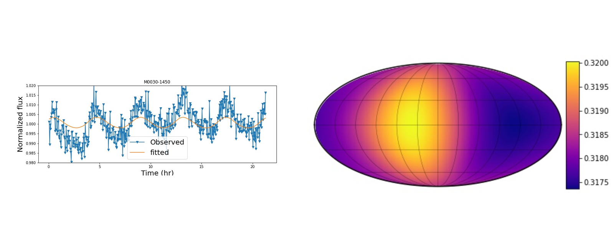

---

title: "Mapping Brown Dwarf and Giant Exoplanet Atmospheres"
summary: "Mapping evolving cloud structures in brown-dwarf and giant-exoplanet atmospheres from rotational variability."
date: 2021-05-01
featured: true
weight: 20
authors:
  - admin

card_label: "Spherical-Harmonic Modeling"

tags:
  - "Atmospheric Variability"
  - "Brown Dwarfs"
  - "Time-Series Analysis"
  - "Photometry"
image:
  preview_only: true
---

## Overview

Brown dwarfs provide accessible analogs for directly imaged giant exoplanets because rotational brightness variations can reveal heterogeneous cloud structures in their atmospheres.

In this project, I used **starry**, a spherical-harmonic light-curve inversion framework, to test how reliably atmospheric brightness maps could be reconstructed from time-series photometry. I first applied the method to synthetic light curves generated from three-dimensional atmospheric circulation models, where the underlying atmospheric behavior was known, and then applied the same framework to published Spitzer observations.

## My Contributions

- Implemented spherical-harmonic light-curve inversion workflows using **starry**.
- Tested reconstruction quality using synthetic light curves generated from three-dimensional atmospheric circulation models.
- Compared atmospheric reconstructions across different spherical-harmonic degrees to assess model complexity.
- Applied the inversion framework to published Spitzer observations of **2MASS J0030300−145033** and **2MASS J06420559+4101599**.
- Evaluated the limitations of static atmospheric maps when applied to evolving rotational variability.

## Methods

The project combined time-series photometry, spherical-harmonic surface representations, light-curve inversion, synthetic-data validation, and model comparison across different harmonic degrees.

## Key Results

- A spherical-harmonic degree of \(l=5\) captured the principal synthetic light-curve structure without introducing the unnecessary complexity present at higher degree.
- A static atmospheric map reproduced the overall variability of **2M0030** reasonably well and recovered a dominant bright atmospheric region.
- The fit was substantially poorer for **2M0642**, whose light curve evolved during the observation.
- The comparison demonstrated that light-curve inversion can recover large-scale atmospheric structure while remaining sensitive to degeneracies and assumptions about temporal evolution.

*The inversion reproduced the overall variability of 2M0030 and recovered a large bright region that dominated the observed modulation.*

## Research Outputs


