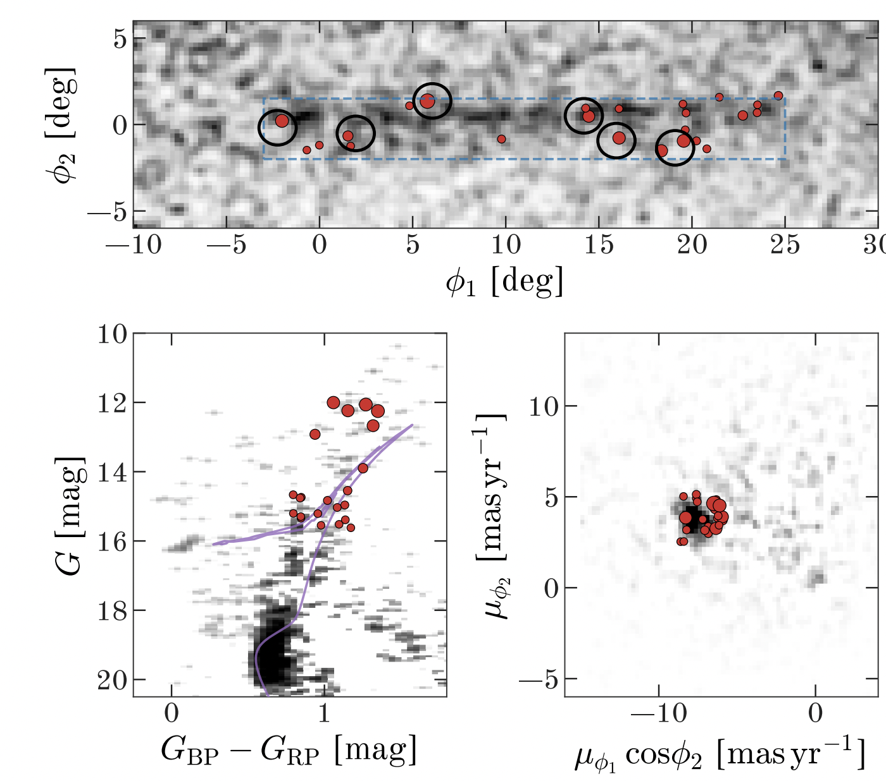

---

title: "Chemodynamically Characterizing the Jhelum Stellar Stream"
summary: "Combining APOGEE-2 spectroscopy and Gaia astrometry to identify members of the Jhelum stellar stream."
date: 2020-01-01
featured: true
weight: 30
authors:
  - admin
tags:
  - "Galactic Archaeology"
  - "Stellar Streams"
  - "Spectroscopy"
  - "Gaia"
image:
  preview_only: true
---

*Candidate red giant members were identified by combining the stream’s position on the sky with photometric and astrometric information from Gaia.*

Stellar streams are remnants of disrupted globular clusters or dwarf galaxies and preserve information about the Milky Way’s assembly history. In this project, we combined high-resolution infrared spectroscopy from **APOGEE-2** with astrometry from **Gaia DR2** to characterize red giant stars in the direction of the Jhelum stellar stream. From an initial sample of 289 APOGEE giants, seven stars had astrometric properties consistent with the stream. One of these was identified as a new Jhelum member near the tip of the red giant branch, with a metallicity of **[Fe/H] = −2.2**.

We compared the candidates’ chemical-abundance patterns and reconstructed Galactic orbits to investigate the nature of Jhelum’s progenitor and its possible relationship to the Gaia–Enceladus–Sausage merger. The Jhelum candidates followed mutually consistent orbits, but their orbital properties were generally inconsistent with a shared origin with the selected Gaia–Enceladus–Sausage population. Their chemical abundances resembled those of stars in other known stellar streams and were consistent with an accreted dwarf-galaxy progenitor, although a globular-cluster origin could not be ruled out.

*The magnesium, calcium, oxygen, and silicon abundances provide chemical constraints on the nature of the stream’s disrupted progenitor.*



