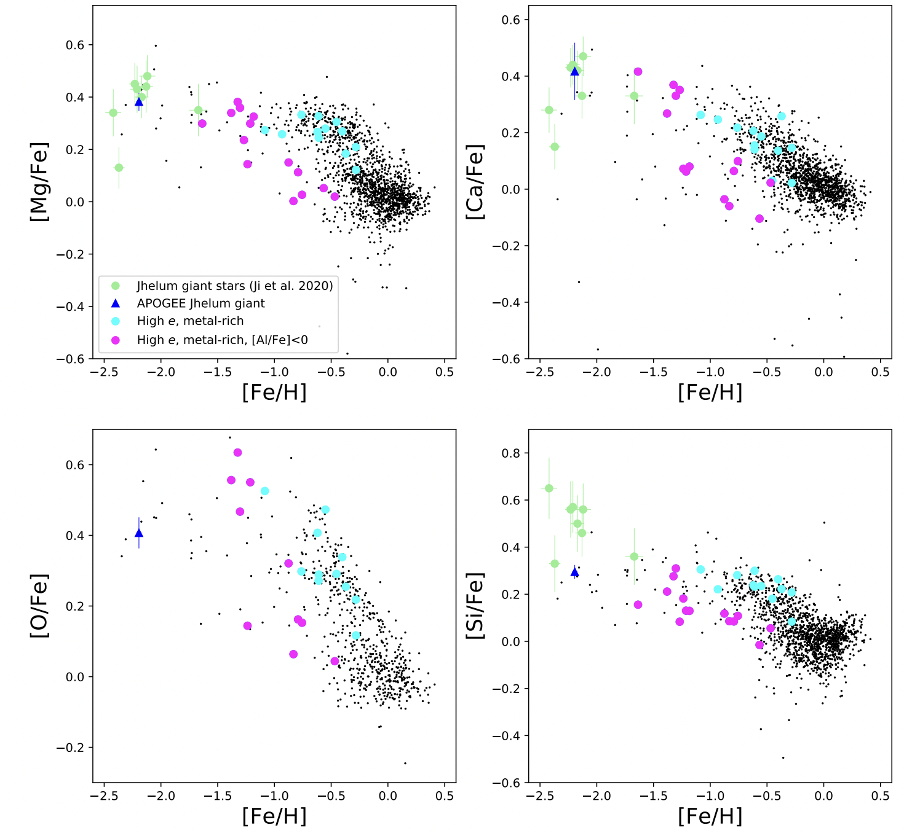

---

title: "Chemodynamically Characterizing the Jhelum Stellar Stream"
summary: "Combining APOGEE spectroscopy and Gaia astrometry to identify and chemically characterize the Jhelum stellar stream."
date: 2020-01-01
featured: true
weight: 30
authors:
  - admin

card_label: "Chemodynamical Analysis"

tags:
  - "Galactic Archaeology"
  - "Stellar Streams"
  - "Spectroscopy"
  - "Gaia"
image:
  preview_only: true
---

## Overview

Stellar streams are remnants of disrupted globular clusters or dwarf galaxies and preserve information about the Milky Way’s assembly history.

In this project, we combined high-resolution infrared spectroscopy from **APOGEE-2** with astrometry from **Gaia DR2** to identify candidate members of the Jhelum stellar stream and investigate the chemical and orbital properties of its disrupted progenitor.

## My Contributions

- Contributed to the identification and evaluation of candidate Jhelum stream members using spectroscopic, photometric, and astrometric information.
- Analyzed APOGEE stellar parameters and chemical-abundance measurements for candidate red giant members.
- Contributed to computational comparisons of candidate kinematics and orbital properties.
- Compared Jhelum chemical-abundance patterns with those of other Milky Way stellar populations and streams.
- Contributed to the analysis presented in the resulting peer-reviewed publication in **The Astrophysical Journal**.

## Methods

The analysis combined high-resolution stellar spectroscopy, Gaia astrometry, chemical-abundance analysis, candidate selection, and Galactic-orbit comparisons to characterize the stream and constrain the nature of its progenitor.

## Key Results

- Seven stars from an initial sample of 289 APOGEE red giants had astrometric properties consistent with the Jhelum stellar stream.
- One candidate was identified as a new Jhelum member near the tip of the red giant branch, with a metallicity of **[Fe/H] = −2.2**.
- The candidate stars followed mutually consistent Galactic orbits.
- Their orbital properties were generally inconsistent with a shared origin with the selected Gaia–Enceladus–Sausage population.
- Their chemical-abundance patterns were consistent with an accreted dwarf-galaxy progenitor, although a globular-cluster origin could not be ruled out.

*The magnesium, calcium, oxygen, and silicon abundances provide chemical constraints on the nature of the stream’s disrupted progenitor.*

## Research Outputs



