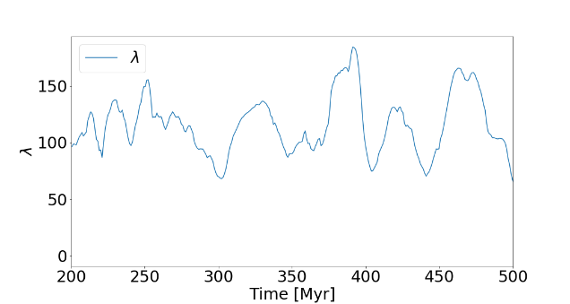

---

title: "Two-Point Statistics in the Star-Forming Interstellar Medium"
summary: "Using two-point statistics to measure the characteristic scale of metallicity homogeneity in simulated star-forming gas."
featured: false
weight: 50
authors:
  - admin

card_label: "Spatial Statistics"

tags:
  - "Interstellar Medium"
  - "Star Formation"
  - "Scientific Computing"
  - "Data Visualization"
image:
  preview_only: true
---

## Overview

Chemical tagging uses stellar abundances to identify stars that may have formed together, but its effectiveness depends on the spatial scale over which star-forming gas is chemically homogeneous.

In this project, I analyzed the spatial distribution of metals in **TIGRESS** simulations of the star-forming interstellar medium. These simulations include magnetohydrodynamics, self-gravity, Galactic shear, star formation, and supernova feedback, allowing me to study how localized enrichment and turbulent mixing shape chemical structure in the gas.

<video controls playsinline muted loop style="width: 100%; border-radius: 0.5rem;">
  <source src="PlotFluct.mp4" type="video/mp4">
  Your browser does not support embedded video.
</video>

*The simulation shows metallicity fluctuations evolving as supernovae inject metals and turbulence redistributes them through the interstellar medium.*

## My Contributions

- Analyzed metallicity fields from **TIGRESS** simulations of the star-forming interstellar medium.
- Implemented a **two-point correlation function** to quantify the spatial coherence of metallicity fluctuations.
- Measured the characteristic scale over which chemical fluctuations remain correlated.
- Tracked the evolution of the half-correlation scale over time.
- Compared changes in the correlation scale with the supernova rate and gas velocity dispersion.
- Produced visualizations of the evolving metallicity field and its characteristic spatial scales.

## Methods

The analysis combined simulation-data processing, spatial statistics, two-point correlation functions, time-dependent analysis, and scientific visualization.

For each simulation snapshot, I measured how the similarity between metallicity fluctuations changed as a function of spatial separation. I then used the resulting correlation function to estimate characteristic mixing scales and examine how those scales evolved with the physical state of the simulated interstellar medium.

## Key Results

- The metallicity correlation fell to one-half at an average separation of approximately **\(120 \pm 25\) pc**.
- Correlations approached zero at separations of roughly **300 pc**.
- The characteristic half-correlation scale varied with time as enrichment and turbulent mixing altered the metallicity field.
- The initial analysis did not reveal a clear direct relationship between the half-correlation scale, supernova rate, and velocity dispersion.
- The results suggested that the competition between localized enrichment and turbulent mixing requires a more detailed time-dependent treatment.

*The characteristic scale at which the metallicity correlation falls to one-half fluctuates around approximately \(120 \pm 25\) pc.*

## Research Outputs

