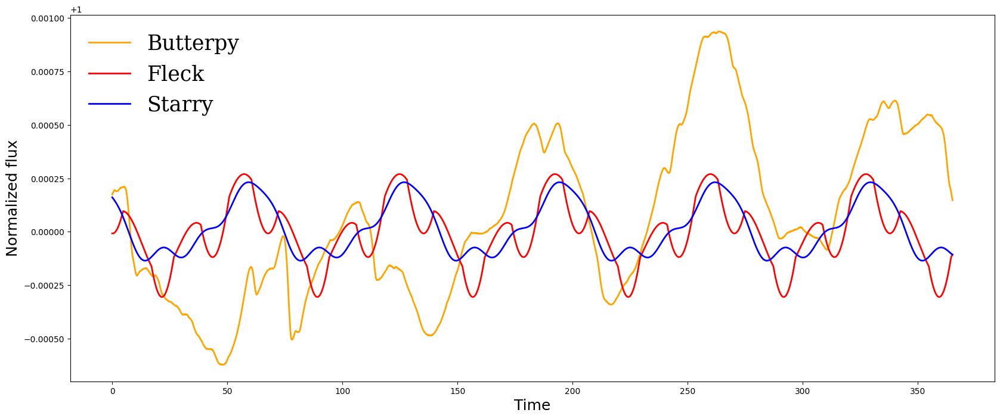
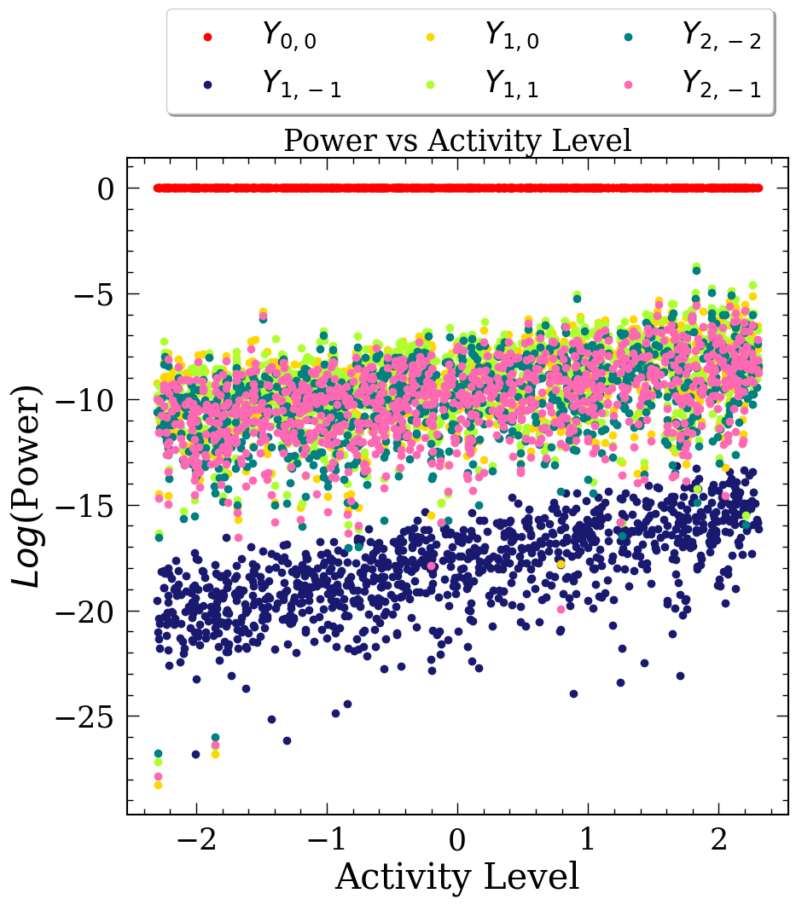

---

title: "Starspot Inference Using Light Curve Inversion Techniques"
summary: "Recovering stellar surface structure from rotational photometric variability."
date: 2023-08-01
featured: true
weight: 10
authors:
  - admin
tags:
  - "Inverse Problems"
  - "Light-Curve Inversion"
  - "Time-Series Analysis"
  - "Scientific Computing"
image:
  preview_only: true
---

*Both inversion methods recover the rotational periodicity of the simulated star, but neither reproduces the evolution of the light-curve amplitude.*

Most stars cannot be spatially resolved, so their surface features must be inferred indirectly from changes in brightness as the star rotates. This thesis investigated which physical properties can be recovered reliably from that one-dimensional signal. I generated synthetic, evolving starspot light curves with **butterpy** and analyzed them using two contrasting approaches: **starry**, which represents surface brightness with spherical harmonics, and **fleck**, which models discrete circular spots.

Both methods recovered stellar rotation but struggled to reproduce changes in amplitude as the spots evolved. They could also produce substantially different surface maps from similar light-curve fits, demonstrating that the locations, sizes, and shapes of individual spots are not uniquely constrained by photometry alone. Across 1,000 simulated light curves, however, greater stellar activity was associated with stronger photometric variability and increased power in higher-order spherical harmonics. The central result is that light-curve inversion is more reliable for recovering statistical indicators of stellar rotation and activity than for producing a unique map of individual starspots.

*Higher activity levels generally require greater power in higher-order spherical harmonics, providing a statistical connection between the inversion output and stellar magnetic activity.*



