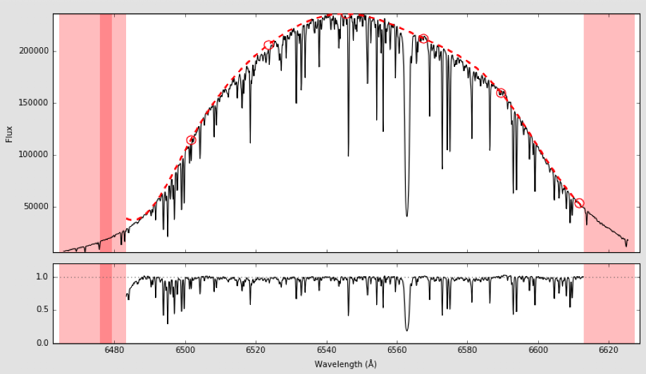
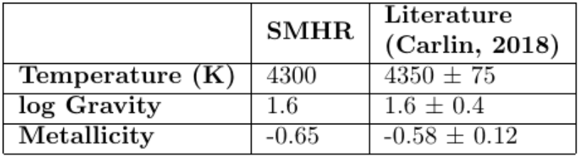

---

title: "Stellar Spectroscopy and Chemical Abundance Analysis"
summary: "Extracting the physical properties of stars from high-resolution spectroscopic observations."
date: 2020-01-01
featured: false
weight: 40
authors:
  - admin
tags:
  - "Stellar Spectroscopy"
  - "Chemical Abundances"
  - "Scientific Computing"
  - "Data Analysis"
image:
  preview_only: true
---

*The analysis workflow involved normalizing high-resolution spectra and measuring the strengths of individual absorption lines before fitting stellar-atmosphere parameters.*

The chemical composition and motion of a star provide clues to where it formed within the Milky Way. In this project, I developed a stellar-spectroscopy workflow for studying red giants near the interface between the Galactic disk and halo. I used **Spectroscopy Made Harder (SMHr)** to normalize high-resolution echelle spectra, measure absorption-line strengths, and iteratively infer atmospheric parameters by comparing the observations with stellar models.

I validated the methodology using the well-studied red giant **Arcturus**. The analysis produced an effective temperature of **4300 K**, a surface gravity of **log \(g = 1.6\)**, and a metallicity of **[Fe/H] = −0.65**. Each value agreed with the literature within its reported uncertainty, providing a proof of concept for applying the same chemical-tagging approach to a larger sample of red giants. The broader goal was to distinguish stars formed in the Milky Way from stars accreted through disrupted satellite galaxies by combining their chemistry with halo-like kinematics.

*The parameters derived with SMHr were consistent with previous measurements, validating the analysis procedure before applying it to additional red giants.*


